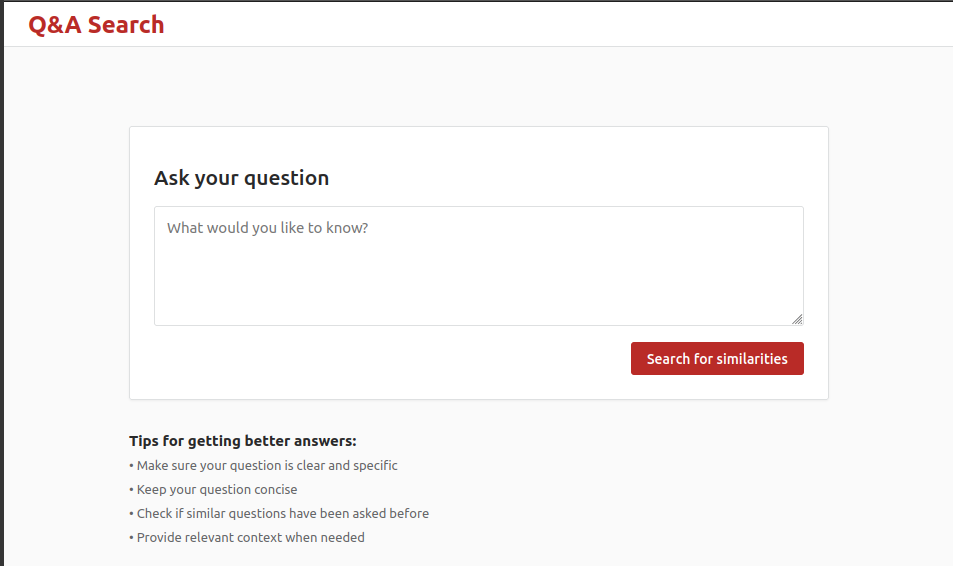
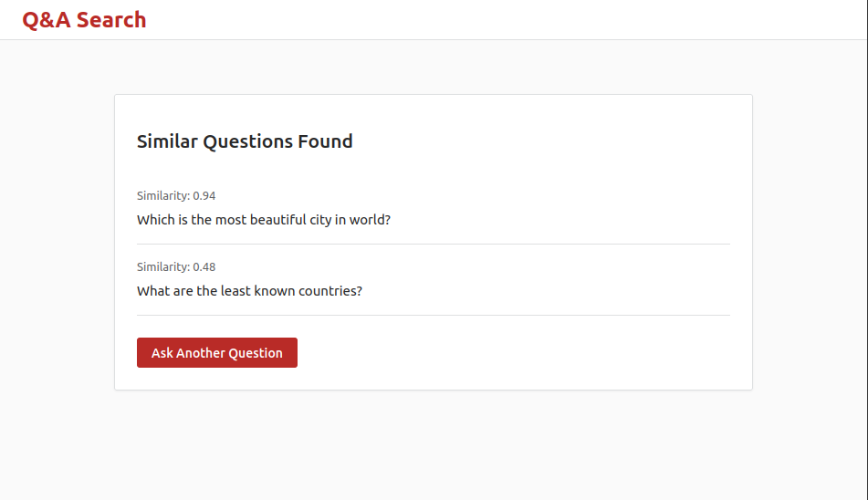

# Semantic Search Engine Application using FastAPI, Pinecone, and Sentence Transformers  

This is a semantic search application (similar to Quora) built using FastAPI, Pinecone, and Sentence Transformers. The application allows users to input text, which is then processed and queried against a Pinecone vector database to find the most relevant matches of questions from quora.

## Features
- **FastAPI**: A modern, fast (high-performance) web framework for building APIs with Python 3.6+.
- **Pinecone**: A vector database for machine learning applications. It is used to store and query high-dimensional vectors.
- **Sentence Transformers**: A library for sentence embeddings using transformer models.


#### Diagram of the application architecture:


#### Endpoints
- **Get /**: Returns the homepage.

- **Post /process**: Returns the search results

### Pinecone usage
 The application uses Pinecone to store and query vectors. The Pinecone API key is stored in the `.env` file.
- The application creates a Pinecone index with the name `quora-index`.
- The vectors are stored in the Pinecone index using the `upsert` method.
- The vectors are queried using the `query` method.
### Sentence-Transformers usage
The application uses Sentence Transformers to encode the input text and the stored vectors. The Sentence Transformers model is loaded using the `sentence-transformers/all-MiniLM-L6-v2` model.

---

### Screenshots
- **Homepage**:

- **Search Results**:


---
<details>
<summary>Installation & Usage</summary>

## Installation & Usage

### 1. Clone the repository
```sh
git clone <repository-url>
cd <repository-directory>
```
### 2. Install dependencies
Install the required dependencies using the `requirements.txt` file.

#### requirements.txt
```txt
fastapi==0.70.0
uvicorn==0.15.0
jinja2==3.0.2
python-dotenv==0.19.2
pinecone-client==2.0.0
sentence-transformers==2.1.0
```

The command to install the dependencies is:
```sh
pip install -r requirements.txt
```

### 3. Set up environment variables
Create a `.env` file in the root directory and add the following environment variables:
```sh
PINECONE_API_KEY=<your-pinecone-api-key>
```

### 4. Run the application
```sh
uvicorn main:app --reload
```

The application will be running at `http://127.0.0.1:8000`.

Enter some text in the input box and click on the "Search" button to find the most relevant matches.
</details>

## Contributing
Contributions are welcome! Please feel free to submit a PR or open an issue if you encounter any problems.
